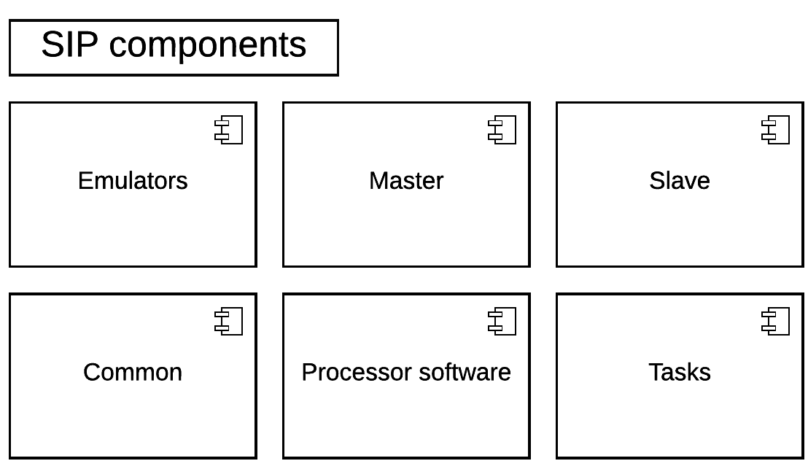

SIP Components / Modules
========================

SIP consists of a number of top level components. These are shown in the
following diagram and described below:

Emulators
---------
Emulators provide the SIP with various components which can substitute for
parts of the SKA system. This would typically be used to provide data to
test an external interface of the SDP, such as visibility data from the CSP,
but could also include components which also mimic internal SDP components.

Master
------
Master defines the Master Controller component of the SDP monitoring and control
subsystem. It is the central hub of the SIP system and therefore responsible for
control and monitoring of other components of the SIP. Master provides the
Master Controller binary.

Slave
-----
Slave defines the set of utilities for running and controlling Slaves. A Slave
is a form of container which is used to run a Task.

Common
------
This module consists of utility functions which are shared by more than
one SIP component, for example logging functions.

Processor software
------------------
This module consists of processor library functions which are used by one or
more tasks. It is envisaged that functions in this module do not depend on any
other SIP components.

Tasks
-----
Tasks define a runnable functionality for the SIP. There are currently two
types of tasks, service tasks and capability tasks. These are differentiated
by their role and expected persistence in the SIP system, with service
tasks expected to be always running and provide utility functions and
capabilities are run on demand to satisfy an incoming requirement on the SDP.
An example of a service task is the Global Sky Model service and an example
Capability is the visibility ingest pipeline.
