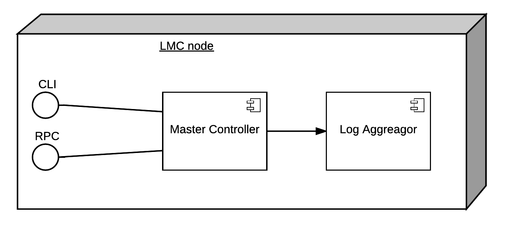
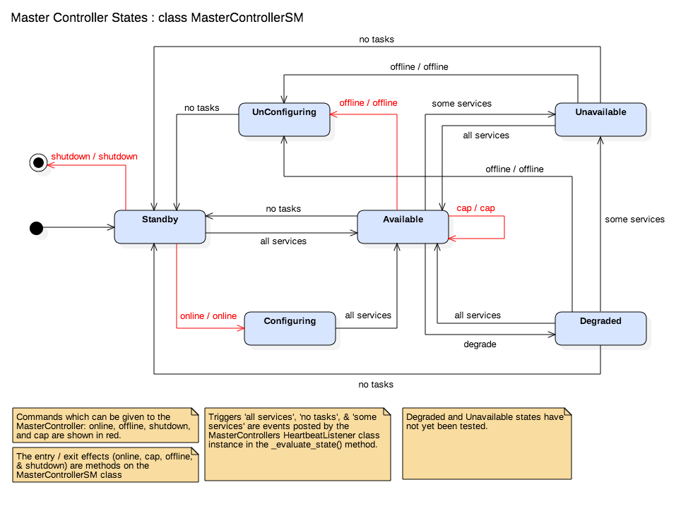
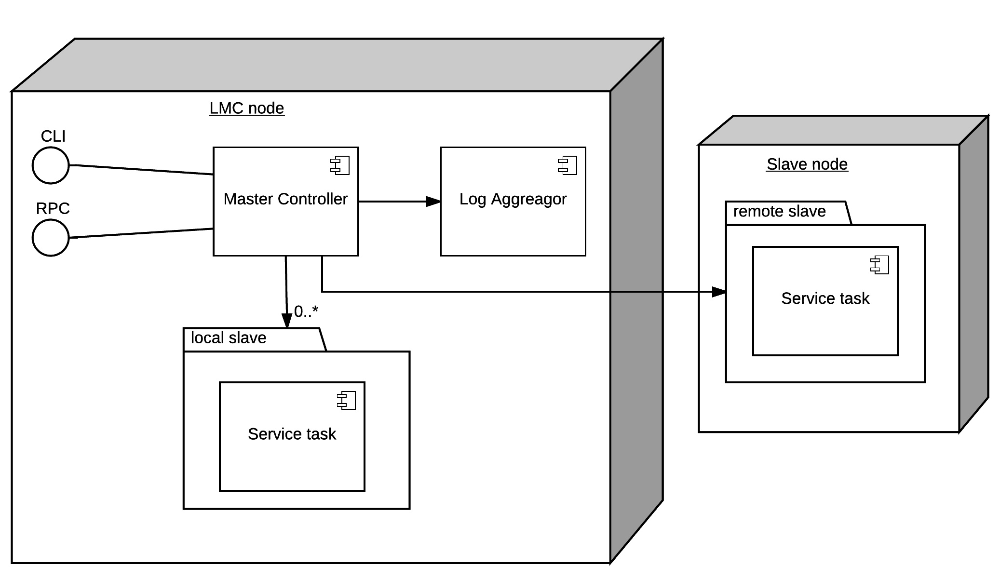

Running the SIP code
====================
The following sections give a brief summary of how to run the SIP code.

Starting the Master Controller
------------------------------
In order to run the SIP code the Master Controller must first be started. This
is achieved by running the command:

.. code:: bash

    python3 master/bin/master

or using the ``sip_run.py`` script and the command:

.. code:: bash

    python3 sip_run.py master

from the top level of the SIP code directory.

Once the Master Controller starts, it presents two interfaces, a command line
interface (CLI) and a Python RPC interface.

The command line interface allows command to be entered directly via a `?`
prompt which should appear as soon as the Master Controller has started.
The Master Controller executable also starts a simple RPC interface which can be
connected to using ``pyrpc``. The script `sip_run.py`` provides an
implementation of this interface to and can be started with the command:

.. code:: bash

    python3 sip_run.py master_rpc

The RPC interface has the advantage of allowing commands to be sent to the
Master Controller without being confused amongst the stream of log messages
being written to stdout.

The Master Controller is controlled by a state machine which is described in
the following diagram:

As can be seen in the diagram above, the Master Controller starts in the
``Standby`` state. From ``Standby`` the command ``online``
starts all required service tasks and brings the Master Controller into
the ``Available`` state and the command ``offline`` will end execution.

Bringing the Master Controller Online
-------------------------------------
With the Master Controller in the ``Standby`` state, issuing the ``online``
command to the CLI or RPC interfaces will put it into the ``Configuring``
state where all of the required online service tasks are started. Service
tasks are defined by a ``"online": true`` setting in their JSON configuration
in the ``master/etc/slave_map.json`` file. The service tasks currently
start as either SSH or Docker slaves according to their specified
``launch_policy`` setting in ``slave_map.json``.

Once the required services have started, the Master Controller will be in the
``Available`` state and will accept further commands (as shown in the state
machine diagram).

Starting a Capability
---------------------
A Capability is a task which is not expected to always be active and can be
called upon to perform a specific role. Capabilities are started by issuing a
``capability`` or ``cap`` command to the Master Controller, eg.:

.. code:: bash

    cap [name] [type]

* ``type`` is used to specify the slave configuration for the capability
  and refers to the configuration group in the ``slave_map.json`` (found in the
  ``master/etc`` folder) file.
* ``name`` is used to give the capability a unique name which is used
  when monitoring its status.

vis_receive
^^^^^^^^^^^

This is an Capability task which ingests visibility data in SPEAD format.
It is started with the command:

.. code:: bash

    cap [name] vis_receive

and will time out after a number of seconds if no data is received as
configured by the ``timeout`` task_control_module setting in its
settings group in the ``slave_map.json`` file.

Shutting down the Master Controller
-----------------------------------

In order to shut down the Master Controller the ``shutdown`` command must be
issued. This is only possible in ``Standby`` state. If the Master Controller
is in the ``Available`` state (ie. after being brought online), the command
``offline`` must be issued first in order to bring the state back to
``Standby``.

If successful, shutting down with terminate all currently running tasks and
Docker containers. If shutdown is unsuccessful you may have to manually clean
up the SIP processes and docker containers before starting SIP again.

Running Emulators
-----------------
Emulators substitute for parts of the SKA system in order to provide
proxies for testing interfaces without the need for an entire fleshed out
component. In the SIP they can be found in the in the ``sip.emulator`` module.

CSP visibility emulator
^^^^^^^^^^^^^^^^^^^^^^^

The CSP visibility emulator sends test visibility data in the form of SPEAD
streams (UDP) to the SIP. It provides a simple Python executable, a Docker
container, and an Python API which could be extended to send more realistic
visibility data in future.

The following command will start the emulator:

.. code:: bash

    python3 -m emulators.csp_visibility_sender -v [config_file]

an example config file can be found in the ``emulators/csp_visibility/etc``
folder.

CSP pulsar emulator
^^^^^^^^^^^^^^^^^^^^^^^

The CSP pulsar emulator sends test pulsar dat through FTP protocol using stream
mode to the SIP.

The following command will start the emulator:

.. code:: bash

    python3 -m emulators.csp_pulsar_sender -v [config_file]

config file can be found in the ``emulators/csp_pulsar_sender/etc``
folder.

